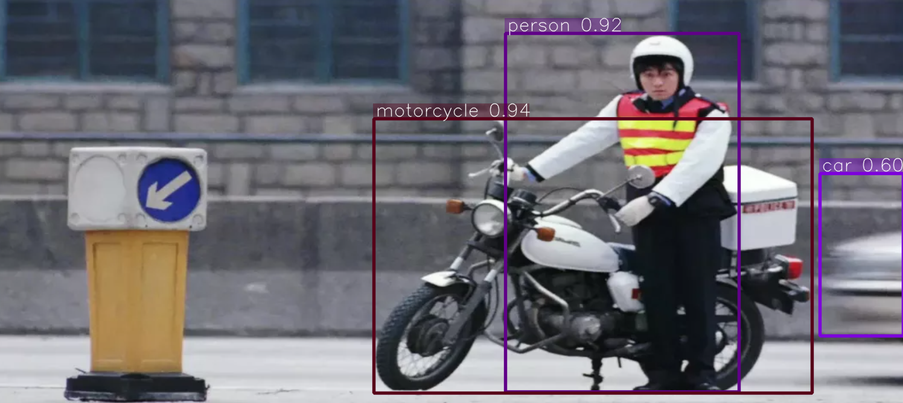

[license-image]: https://img.shields.io/badge/license-Anti%20996-blue.svg
[license-url]: https://github.com/996icu/996.ICU/blob/master/LICENSE
[pypi-image]: https://badge.fury.io/py/tfyolo.svg
[pypi-url]: https://pypi.python.org/pypi/tfyolo
[pepy-image]: https://pepy.tech/badge/tfyolo/month
[pepy-url]: https://pepy.tech/project/tfyolo
[build-image]: https://github.com/LongxingTan/tf-yolo/actions/workflows/test.yml/badge.svg?branch=master
[build-url]: https://github.com/LongxingTan/tf-yolo/actions/workflows/test.yml?query=branch%3Amaster
[lint-image]: https://github.com/LongxingTan/tf-yolo/actions/workflows/lint.yml/badge.svg?branch=master
[lint-url]: https://github.com/LongxingTan/tf-yolo/actions/workflows/lint.yml?query=branch%3Amaster
[docs-image]: https://readthedocs.org/projects/tf-yolo/badge/?version=latest
[docs-url]: https://tf-yolo.readthedocs.io/en/latest/
[coverage-image]: https://codecov.io/gh/longxingtan/tf-yolo/branch/dev/graph/badge.svg
[coverage-url]: https://codecov.io/github/longxingtan/tf-yolo
[codeql-image]: https://github.com/longxingtan/tf-yolo/actions/workflows/codeql-analysis.yml/badge.svg
[codeql-url]: https://github.com/longxingtan/tf-yolo/actions/workflows/codeql-analysis.yml

<h1 align="center">

</h1><br>

[![LICENSE][license-image]][license-url]
[![PyPI Version][pypi-image]][pypi-url]
[![Download][pepy-image]][pepy-url]
[![Build Status][build-image]][build-url]
[![Lint Status][lint-image]][lint-url]
[![Docs Status][docs-image]][docs-url]
[![Code Coverage][coverage-image]][coverage-url]
[![CodeQL Status][codeql-image]][codeql-url]

**[Documentation](https://tf-yolo.readthedocs.io)** | **[Tutorials](https://tf-yolo.readthedocs.io/en/latest/tutorials.html)** | **[Release Notes](https://tf-yolo.readthedocs.io/en/latest/CHANGELOG.html)** | **[中文](https://github.com/LongxingTan/tf-yolo/blob/master/README_CN.md)**

**tfyolo** is a YOLO (you only look once) object detection package implemented in TensorFlow or Keras<br>

- minimal Yolo implementation by pure tensorflow2
- yaml file to configure the model
- custom data training
- mosaic data augmentation
- label encoding by iou or wh ratio of anchor
- positive sample augment
- multi-gpu training



## Tutorial

**Installation**

- python >= 3.7
- tensorflow >= 2.1

```bash
$ pip install tfyolo
```

**prepare the data**

```bash
$ bash data/scripts/get_voc.sh
$ cd yolo
$ python dataset/prepare_data.py
```
If you want to train on custom dataset, PLEASE note the input data should like this:
```
image_dir/001.jpg x_min, y_min, x_max, y_max, class_id x_min2, y_min2, x_max2, y_max2, class_id2
```
And new anchor need to be created, don't forget to change the nc(number classes) in yolo-yaml.
```
$ python dataset/create_anchor.py
```


**Train**

```
import tfyolo
from tfyolo import AutoYolo, YoloLoss, Trainer

train, valid = tfyolo.get_data("voc17")

model = AutoYolo.from_pretrained("v5")
trainer = Trainer(model, loss_fn=YoloLoss)
trainer.train(train, valid)

```

**serving**
```
Test
```

[//]: # ()
[//]: # (## Performance)

[//]: # ()
[//]: # (| Model | Size | AP<sup>val</sup> | AP<sub>50</sub><sup>val</sup> | AP<sub>75</sub><sup>val</sup> |  cfg | weights |)

[//]: # (| :-- | :-: | :-: | :-: | :-: | :-: | :-: |)

[//]: # (| YOLOV5s | 672 | 47.7% |52.6% | 61.4% | [cfg]&#40;https://github.com/WongKinYiu/PyTorch_YOLOv4/blob/master/cfg/yolov4.cfg&#41; | [weights]&#40;https://drive.google.com/file/d/137U-oLekAu-J-fe0E_seTblVxnU3tlNC/view?usp=sharing&#41; |)

[//]: # (| YOLOV5m | 672 | 47.7% |52.6% | 61.4% | [cfg]&#40;https://github.com/WongKinYiu/PyTorch_YOLOv4/blob/master/cfg/yolov4.cfg&#41; | [weights]&#40;https://drive.google.com/file/d/137U-oLekAu-J-fe0E_seTblVxnU3tlNC/view?usp=sharing&#41; |)

[//]: # (| YOLOV5l | 672 | 47.7% |52.6% | 61.4% | [cfg]&#40;https://github.com/WongKinYiu/PyTorch_YOLOv4/blob/master/cfg/yolov4.cfg&#41; | [weights]&#40;https://drive.google.com/file/d/137U-oLekAu-J-fe0E_seTblVxnU3tlNC/view?usp=sharing&#41; |)

[//]: # (| YOLOV5x | 672 | 47.7% |52.6% | 61.4% | [cfg]&#40;https://github.com/WongKinYiu/PyTorch_YOLOv4/blob/master/cfg/yolov4.cfg&#41; | [weights]&#40;https://drive.google.com/file/d/137U-oLekAu-J-fe0E_seTblVxnU3tlNC/view?usp=sharing&#41; |)

[//]: # (|  |  |  |  |  |  |  |)


## Citation

If you find tfyolo project useful in your research, please consider cite:

```
@misc{tfyolo2021,
    title={tfyolo: yolo benchmark in tensorflow},
    author={Longxing Tan},
    howpublished = {\url{https://github.com/longxingtan/tfyolo}},
    year={2021}
}
```
